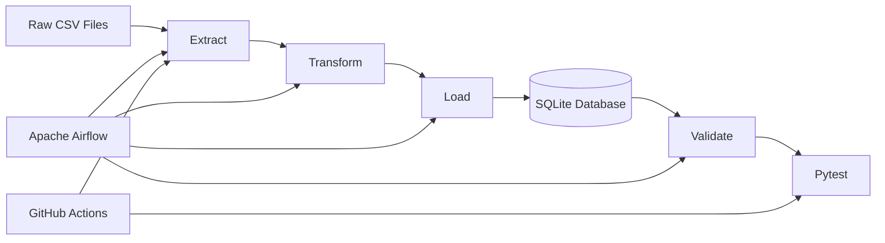
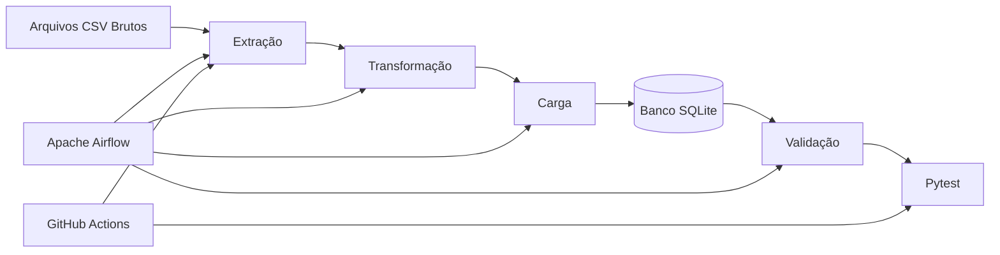
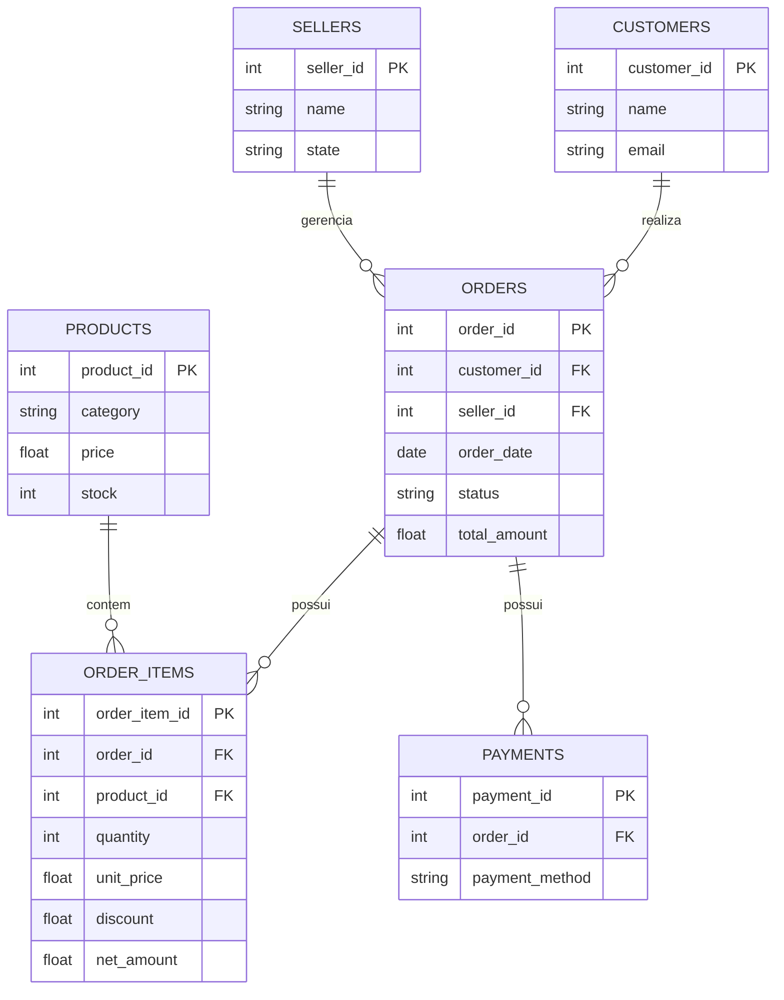

## 🌎 Documentação

Este projeto possui documentação disponível em **português e inglês**:
* 🇧🇷 **Português:** [README.md](README.pt.md)
* 🇺🇸 **English:** [README.en.md](README.md)
A versao em português também se encontra no final deste arquivo.


# 🛒 Ecommerce Data Platform


**End-to-end data engineering pipeline for a fictional e-commerce platform, focused on ETL, data quality, relational modeling, orchestration, automated testing and CI.**

Built with **Python, Pandas, SQLite, SQL, Apache Airflow, Docker, Pytest and GitHub Actions**.

---

## 📌 About the Project

This project simulates a real-world data engineering scenario where messy raw e-commerce data is processed through a complete and reproducible ETL pipeline.

The pipeline takes synthetic CSV datasets through:

**Extraction → Transformation → Loading → Validation → Automated Testing**

The project focuses not only on moving data, but also on:

* Data quality assessment
* Data cleaning and standardization
* Business-rule validation
* Referential integrity
* Database transactions
* Post-load validation
* Automated testing
* Pipeline orchestration
* Continuous Integration
* Documentation of data quality issues and engineering decisions

> **Note:** The datasets are synthetic and were created specifically for this portfolio project. They are intentionally designed to contain data quality problems that can be identified and handled by the pipeline.

---

## 🏗️ Architecture



### Pipeline Flow

```text
Raw CSV
   │
   ▼
Extract
   │
   ├── File validation
   ├── Schema checks
   ├── Null analysis
   └── Duplicate detection
   │
   ▼
Transform
   │
   ├── Cleaning
   ├── Standardization
   ├── Business rules
   └── Referential integrity
   │
   ▼
Load
   │
   ├── SQLite
   ├── Transactions
   └── Rollback on failure
   │
   ▼
Validate
   │
   ├── Record counts
   ├── Primary keys
   ├── Foreign keys
   └── Critical nulls
   │
   ▼
Automated Tests
   │
   ▼
CI — GitHub Actions
```

---

## 🛠️ Technologies

| Technology                  | Purpose                                |
| --------------------------- | -------------------------------------- |
| **Python**                  | ETL and data engineering               |
| **Pandas**                  | Data extraction and transformation     |
| **SQL**                     | Data modeling, validation and analysis |
| **SQLite**                  | Relational database                    |
| **Apache Airflow**          | Pipeline orchestration                 |
| **Docker / Docker Compose** | Local Airflow environment              |
| **Pytest**                  | Automated testing                      |
| **Git / GitHub**            | Version control                        |
| **GitHub Actions**          | Continuous Integration                 |

---

## 📂 Project Structure

```text
ecommerce-data-platform/
│
├── .github/
│   └── workflows/
│       └── ci.yml
│
├── data/
│   ├── raw/
│   │   ├── customers.csv
│   │   ├── products.csv
│   │   ├── orders.csv
│   │   ├── order_items.csv
│   │   ├── sellers.csv
│   │   └── payments.csv
│   │
│   ├── processed/
│   └── database/
│       └── ecommerce.db
│
├── src/
│   ├── extract.py
│   ├── transform.py
│   ├── load.py
│   ├── validate.py
│   ├── check_db.py
│   └── main.py
│
├── tests/
│   ├── test_extract.py
│   ├── test_load.py
│   ├── test_validate.py
│   ├── test_transform.py
│   └── test_database.py
│
├── dags/
│   └── ecommerce_pipeline.py
│
├── requirements.txt
├── schema.sql
├── docker-compose.yml
├── .gitignore
└── README.md
```

### Main Components

| File                         | Responsibility                          |
| ---------------------------- | --------------------------------------- |
| `src/extract.py`             | Reads and profiles raw datasets         |
| `src/transform.py`           | Cleans, standardizes and validates data |
| `src/load.py`                | Loads processed data into SQLite        |
| `src/validate.py`            | Performs post-load data quality checks  |
| `src/main.py`                | Orchestrates the complete pipeline      |
| `dags/ecommerce_pipeline.py` | Airflow orchestration                   |
| `schema.sql`                 | Database schema                         |
| `tests/`                     | Automated test suite                    |
| `.github/workflows/ci.yml`   | GitHub Actions CI                       |

---

## 🗄️ Data Model

The project contains six relational tables:


---

# 🚀 How to Run

## 1. Clone the repository

```bash
git clone https://github.com/mariellepmiziara/ecommerce-data-platform.git
cd ecommerce-data-platform
```

## 2. Create a virtual environment

### Windows PowerShell

```powershell
python -m venv .venv
.\.venv\Scripts\Activate.ps1
```

## 3. Install dependencies

```bash
pip install -r requirements.txt
```

## 4. Run the complete pipeline

From the repository root:

```bash
python -m src.main
```

The pipeline executes:

```text
Extract
   ↓
Transform
   ↓
Load
   ↓
Validate
```

A successful execution ends with:

```text
🎉 PIPELINE EXECUTADO COM SUCESSO
```

---

## 🧪 Run the Tests

Execute the complete test suite:

```bash
pytest tests/ -v --tb=short
```

The tests cover:

* Extraction
* Transformation
* Loading
* Validation
* Database integrity

---

# 🔄 Pipeline Stages

## 1. Extract

`extract.py` reads the raw CSV files and performs an initial quality assessment.

### Checks performed

* File existence
* CSV parsing
* Encoding
* Empty files
* Number of rows
* Number of columns
* Null values
* Duplicate records
* Data types

The extraction stage handles errors such as:

```text
FileNotFoundError
EmptyDataError
ParserError
```

---

## 2. Transform

`transform.py` applies the data cleaning and business rules.

### Cleaning

* Text normalization
* Whitespace removal
* Category standardization
* Date parsing
* Duplicate removal

### Validation rules

Examples:

```text
price > 0
quantity > 0
0 <= discount <= 1
```

Invalid records are removed before loading.

### Referential Integrity

Parent tables are cleaned before their dependent tables.

For example:

```text
orders
  ├── order_items
  └── payments

products
  └── order_items
```

If an order or product is removed during cleaning, dependent records referencing it are also removed.

This prevents orphan records from reaching the database.

---

## 3. Load

`load.py` loads the processed datasets into SQLite.

The current strategy is **full refresh**.

The database is recreated and the complete cleaned dataset is loaded on each execution.

The load process uses transactions:

```text
BEGIN
   ↓
Load tables
   ↓
Validation of load process
   ↓
COMMIT
```

If an error occurs:

```text
ROLLBACK
```

This prevents a partially loaded database.

---

## 4. Validate

`validate.py` performs post-load database validation.

Checks include:

* Table record counts
* Empty tables
* Primary-key duplicates
* Foreign-key integrity
* Critical null values
* Relationship consistency

If a validation rule fails, the pipeline raises:

```python
DataValidationError
```

This causes both the local pipeline and automated CI workflow to fail instead of silently continuing with invalid data.

---

# 🔍 Data Quality

Data quality is treated as a core part of the pipeline.

The project follows:

```text
Profile
   ↓
Clean
   ↓
Validate
   ↓
Load
   ↓
Validate Again
```

This approach prevents data quality problems from being silently propagated into the database.

---

# ⚠️ Data Quality Findings

During development, two relevant data quality issues were identified.

## 1. Referential Integrity Orphans — Fixed

Before the fix, `order_items` and `payments` contained records referencing orders/products that had been removed during the cleaning process.

A dedicated function was implemented:

```python
enforce_referential_integrity()
```

The result was:

```text
order_items: 24,997 → 24,734
payments:    10,000 → 9,997
```

All identified orphan records were removed before loading.

---

## 2. `orders.total_amount` vs. `order_items.net_amount`

A reconciliation analysis showed that:

```text
orders.total_amount
```

does not reconcile with:

```text
SUM(order_items.net_amount)
```

The discrepancy affects the entire dataset.

Aggregate comparison:

```text
orders.total_amount      ≈ $16.0M
order_items.net_amount   ≈ $78.9M
```

The investigation showed that the fields were independently generated in the synthetic dataset.

Because the discrepancy is systematic, rather than an isolated data-entry error, it was **documented instead of silently corrected**.

This demonstrates an important data engineering principle:

> **A pipeline should identify and document source-data problems instead of hiding them.**

---

# 📊 Exploratory Analysis

Exploratory analysis was performed using the trusted revenue sources.

Because the dataset is synthetic, the results are intentionally not interpreted as real-world business behavior.

### Revenue over time

Monthly revenue is relatively flat:

```text
≈ $1.3M – $1.6M
```

No meaningful seasonality was identified.

### Revenue by category

Approximate revenue:

```text
Books    → $16.2M
Beauty   → $15.7M
Sports   → $9.5M
```

The relatively narrow variation is atypical of a real e-commerce catalog.

### Payment methods

The four payment methods have similar order volumes and average order values.

No payment method presents a significant difference in behavior.

### Order status

```text
Completed → 73.3%
Cancelled →  9.62%
Pending   →  9.57%
Returned  →  7.5%
```

Average order value varies little by status.

### Sellers

The top seller generated approximately:

```text
$2.03M
```

across 236 orders.

The top sellers have relatively similar performance.

### Customer geography

Customers are relatively evenly distributed across Brazilian states, without strong geographic concentration.

---

# 💼 Documented Business Decisions

## `customers.email` can be NULL

A missing email does not invalidate a customer record.

Therefore:

```text
customers.email → nullable
```

This rule is explicitly supported by `validate.py`.

---

## `orders.total_amount` is not trusted

Due to the systematic reconciliation issue, financial analysis uses:

```text
order_items.net_amount
```

through the trusted analytical view:

```text
vw_orders_trusted
```

The original `orders.total_amount` is preserved as historical source information but is not used as the trusted revenue metric.

---

# 🔁 Load Strategy: Full Refresh vs. Incremental

The current implementation uses **full refresh**.

Every execution recreates the SQLite database and reloads the complete dataset.

### Why?

This is intentional because:

* The dataset is synthetic.
* The source is static.
* The dataset is relatively small.
* There is no continuous production feed.
* Full refresh is simple.
* The pipeline is naturally idempotent.

The dataset contains approximately:

```text
25K order_items
```

at most, making full refresh appropriate for this project.

### Production alternative

For a production pipeline processing millions or billions of records, incremental loading would be more appropriate.

A possible architecture would use:

1. A watermark such as `order_date` or `updated_at`.
2. A control table.
3. Incremental extraction.
4. Upsert logic.
5. Transactional watermark updates.

For example:

```sql
INSERT ... ON CONFLICT DO UPDATE
```

could be used to update existing records without duplicating them.

Incremental loading is intentionally not implemented because the current synthetic source does not require it.

---

# ☁️ Airflow Orchestration

The project includes an Apache Airflow DAG:

```text
dags/ecommerce_pipeline.py
```

The DAG orchestrates:

```text
Extract
   ↓
Transform
   ↓
Load
   ↓
Validate
```

The validation stage is designed to fail the DAG when data quality requirements are not met.

The local Airflow environment can be started with:

```bash
docker compose up
```

---

# 🔄 Continuous Integration

GitHub Actions automatically validates changes to the project.

The workflow:

```text
Checkout
   ↓
Python 3.12
   ↓
Install dependencies
   ↓
Run ETL pipeline
   ↓
Run pytest
```

The workflow is triggered on:

* Push to `main`
* Push to `master`
* Pull requests targeting `main`
* Pull requests targeting `master`

The current CI pipeline is **passing**.


If the pipeline fails, the workflow also attempts to upload the generated SQLite database as an artifact for troubleshooting.

---

# 📈 Current Pipeline Results

The current successful pipeline produces approximately:

| Dataset     | Records |
| ----------- | ------: |
| Customers   |   1,000 |
| Products    |     198 |
| Sellers     |      50 |
| Orders      |   9,997 |
| Order Items |  24,734 |
| Payments    |   9,996 |

These values represent the cleaned and validated output of the current synthetic dataset.

---

# 🎯 Engineering Practices Demonstrated

This project demonstrates practical application of:

* ETL pipeline architecture
* Python
* Pandas
* SQL
* Relational data modeling
* Data cleaning
* Data profiling
* Data quality validation
* Referential integrity
* Business-rule validation
* Error handling
* Transaction management
* Full-refresh loading
* Incremental-loading design
* Automated testing
* Pytest
* Apache Airflow
* Docker
* Git
* GitHub
* GitHub Actions
* Continuous Integration
* Reproducible pipelines
* Technical documentation
* Data-driven engineering decisions

---

# 🚧 Future Improvements

The core ETL pipeline, validation, automated tests, Airflow orchestration and CI are already implemented.

Possible future improvements:

* [ ] Move Docker/database credentials to `.env`
* [ ] Expand automated data quality tests
* [ ] Add Airflow failure notifications
* [ ] Implement an incremental-loading version
* [ ] Add more analytical SQL views
* [ ] Add a BI/dashboard consumption layer
* [ ] Explore a cloud-based architecture
* [ ] Add data lineage documentation
* [ ] Add containerized CI execution

---

# 👩‍💻 Author

**Marielle Miziara**

Data Engineering | Data Analytics | BI

Focused on building reliable data pipelines, transforming raw data into trustworthy information, and applying data engineering practices to real-world problems.

---

## ⭐ Project Purpose

This project was created as a portfolio demonstration of **data engineering fundamentals applied end-to-end**.

The main objective is not simply to make an ETL pipeline run successfully, but to demonstrate how a data engineer should approach:

```text
Raw Data
   ↓
Data Quality
   ↓
Transformation
   ↓
Data Integrity
   ↓
Reliable Storage
   ↓
Validation
   ↓
Automated Testing
   ↓
Orchestration
   ↓
Continuous Integration
```

**Reliable data starts with reliable engineering.**


# **🌎 Documentação 🇧🇷 Português: README.md**


# 🛒 Ecommerce Data Platform


**Pipeline completo de Engenharia de Dados para uma plataforma de e-commerce fictícia, com foco em ETL, qualidade de dados, modelagem relacional, orquestração, testes automatizados e CI.**

Desenvolvido com **Python, Pandas, SQLite, SQL, Apache Airflow, Docker, Pytest e GitHub Actions**.

---

## 📌 Sobre o Projeto

Este projeto simula um cenário real de Engenharia de Dados, no qual dados brutos e inconsistentes de um e-commerce passam por um pipeline ETL completo e reproduzível.

O pipeline transforma dados em formato CSV por meio das seguintes etapas:

**Extração → Transformação → Carga → Validação → Testes Automatizados**

O projeto não se limita à movimentação dos dados. Ele também contempla:

* Avaliação da qualidade dos dados
* Limpeza e padronização
* Validação de regras de negócio
* Integridade referencial
* Transações no banco de dados
* Validação após a carga
* Testes automatizados
* Orquestração do pipeline
* Integração Contínua
* Documentação de problemas de qualidade
* Registro das decisões de negócio e engenharia

> **Observação:** os dados utilizados são sintéticos e foram criados especificamente para este projeto de portfólio. Eles contêm propositalmente problemas de qualidade para demonstrar como um pipeline de Engenharia de Dados pode identificá-los e tratá-los.

---

## 🏗️ Arquitetura



### Fluxo do Pipeline

```text
Dados Brutos
     │
     ▼
  Extração
     │
     ├── Validação dos arquivos
     ├── Verificação do esquema
     ├── Análise de valores nulos
     └── Detecção de duplicidades
     │
     ▼
Transformação
     │
     ├── Limpeza
     ├── Padronização
     ├── Regras de negócio
     └── Integridade referencial
     │
     ▼
    Carga
     │
     ├── SQLite
     ├── Transações
     └── Rollback em caso de falha
     │
     ▼
  Validação
     │
     ├── Contagem de registros
     ├── Chaves primárias
     ├── Chaves estrangeiras
     └── Colunas críticas
     │
     ▼
Testes Automatizados
     │
     ▼
GitHub Actions — CI
```

---

## 🛠️ Tecnologias

| Tecnologia                  | Utilização                         |
| --------------------------- | ---------------------------------- |
| **Python**                  | Desenvolvimento do pipeline ETL    |
| **Pandas**                  | Extração e transformação dos dados |
| **SQL**                     | Modelagem, validação e análise     |
| **SQLite**                  | Banco de dados relacional          |
| **Apache Airflow**          | Orquestração do pipeline           |
| **Docker / Docker Compose** | Ambiente local do Airflow          |
| **Pytest**                  | Testes automatizados               |
| **Git / GitHub**            | Controle de versão                 |
| **GitHub Actions**          | Integração Contínua (CI)           |

---

## 📂 Estrutura do Projeto

```text
ecommerce-data-platform/
│
├── .github/
│   └── workflows/
│       └── ci.yml
│
├── data/
│   ├── raw/
│   │   ├── customers.csv
│   │   ├── products.csv
│   │   ├── orders.csv
│   │   ├── order_items.csv
│   │   ├── sellers.csv
│   │   └── payments.csv
│   │
│   ├── processed/
│   └── database/
│       └── ecommerce.db
│
├── src/
│   ├── extract.py
│   ├── transform.py
│   ├── load.py
│   ├── validate.py
│   ├── check_db.py
│   └── main.py
│
├── tests/
│   ├── test_extract.py
│   ├── test_load.py
│   ├── test_validate.py
│   ├── test_transform.py
│   └── test_database.py
│
├── dags/
│   └── ecommerce_pipeline.py
│
├── requirements.txt
├── schema.sql
├── docker-compose.yml
├── .gitignore
└── README.md
```

### Principais Componentes

| Arquivo                      | Responsabilidade                          |
| ---------------------------- | ----------------------------------------- |
| `src/extract.py`             | Leitura e perfil inicial dos dados        |
| `src/transform.py`           | Limpeza, padronização e regras de negócio |
| `src/load.py`                | Carga dos dados no SQLite                 |
| `src/validate.py`            | Validação da qualidade após a carga       |
| `src/main.py`                | Orquestração do pipeline completo         |
| `dags/ecommerce_pipeline.py` | Orquestração com Airflow                  |
| `schema.sql`                 | Definição do esquema do banco             |
| `tests/`                     | Suíte de testes automatizados             |
| `.github/workflows/ci.yml`   | Pipeline de Integração Contínua           |

---

## 🗄️ Modelo de Dados

O projeto possui seis tabelas relacionais:



| Tabela        | Chave Primária  | Relacionamentos                                  |
| ------------- | --------------- | ------------------------------------------------ |
| `customers`   | `customer_id`   | —                                                |
| `products`    | `product_id`    | —                                                |
| `sellers`     | `seller_id`     | —                                                |
| `orders`      | `order_id`      | `customer_id → customers`, `seller_id → sellers` |
| `order_items` | `order_item_id` | `order_id → orders`, `product_id → products`     |
| `payments`    | `payment_id`    | `order_id → orders`                              |

---

# 🚀 Como Executar

## 1. Clone o repositório

```bash
git clone https://github.com/mariellepmiziara/ecommerce-data-platform.git
cd ecommerce-data-platform
```

## 2. Crie um ambiente virtual

### Windows PowerShell

```powershell
python -m venv .venv
.\.venv\Scripts\Activate.ps1
```

## 3. Instale as dependências

```bash
pip install -r requirements.txt
```

## 4. Execute o pipeline completo

A partir da raiz do projeto:

```bash
python -m src.main
```

O pipeline executa:

```text
Extração
    ↓
Transformação
    ↓
Carga
    ↓
Validação
```

Uma execução bem-sucedida termina com:

```text
🎉 PIPELINE EXECUTADO COM SUCESSO
```

---

# 🧪 Testes Automatizados

Para executar toda a suíte de testes:

```bash
pytest tests/ -v --tb=short
```

Os testes abrangem:

* Extração
* Transformação
* Carga
* Validação
* Integridade do banco de dados

---

# 🔄 Etapas do Pipeline

## 1. Extração

O `extract.py` realiza a leitura dos arquivos CSV e uma avaliação inicial da qualidade dos dados.

### Validações realizadas

* Existência dos arquivos
* Leitura dos CSVs
* Encoding
* Arquivos vazios
* Erros de parsing
* Quantidade de linhas
* Quantidade de colunas
* Valores nulos
* Registros duplicados
* Tipos de dados

São tratados erros como:

```text
FileNotFoundError
EmptyDataError
ParserError
```

Cada conjunto de dados recebe uma avaliação inicial antes da transformação.

---

## 2. Transformação

O `transform.py` executa a limpeza, padronização e aplicação das regras de negócio.

### Limpeza

* Normalização de textos
* Remoção de espaços desnecessários
* Padronização de categorias
* Conversão de datas
* Remoção de duplicidades

### Regras de negócio

Exemplos:

```text
price > 0
quantity > 0
0 <= discount <= 1
```

Registros que violam essas regras são removidos antes da carga.

### Integridade Referencial

As tabelas principais são tratadas antes das tabelas dependentes.

Por exemplo:

```text
orders
  ├── order_items
  └── payments

products
  └── order_items
```

Se um pedido ou produto for removido durante a limpeza, os registros dependentes que apontam para ele também são removidos.

Isso evita registros órfãos no banco de dados.

---

## 3. Carga

O `load.py` carrega os dados tratados no SQLite.

A estratégia atual é de **carga completa (full refresh)**.

A cada execução:

1. O banco é recriado.
2. O esquema é recriado.
3. Os dados tratados são carregados.
4. A transação é confirmada.

O processo utiliza transações:

```text
BEGIN
   ↓
Carga das tabelas
   ↓
COMMIT
```

Em caso de erro:

```text
ROLLBACK
```

Isso evita que o banco permaneça parcialmente carregado.

---

## 4. Validação

O `validate.py` realiza validações diretamente no banco após a carga.

São verificadas:

* Quantidade de registros
* Tabelas vazias
* Duplicidade de chaves primárias
* Integridade de chaves estrangeiras
* Valores nulos em colunas críticas
* Consistência dos relacionamentos

Quando uma regra de validação falha, o pipeline gera:

```python
DataValidationError
```

Dessa forma, tanto a execução local quanto o CI identificam a falha em vez de simplesmente continuar com dados inválidos.

---

# 🔍 Qualidade dos Dados

A qualidade dos dados é tratada como parte central do pipeline.

O projeto segue o fluxo:

```text
Perfil dos dados
      ↓
Limpeza
      ↓
Validação
      ↓
Carga
      ↓
Nova validação
```

O objetivo é impedir que problemas de qualidade sejam silenciosamente propagados para o banco de dados.

---

# ⚠️ Problemas de Qualidade Identificados

Durante o desenvolvimento, dois problemas relevantes foram identificados.

## 1. Registros órfãos — Corrigido

Antes da correção, `order_items` e `payments` possuíam registros que referenciavam pedidos ou produtos removidos durante o processo de limpeza.

Foi implementada a função:

```python
enforce_referential_integrity()
```

Resultado:

```text
order_items: 24.997 → 24.734
payments:    10.000 → 9.997
```

Os registros órfãos identificados foram removidos antes da carga.

---

## 2. Divergência entre `orders.total_amount` e `order_items.net_amount`

Uma análise de reconciliação mostrou que:

```text
orders.total_amount
```

não corresponde à soma de:

```text
SUM(order_items.net_amount)
```

A divergência ocorre em 100% dos pedidos.

A análise agregada apresentou aproximadamente:

```text
orders.total_amount     → $16,0M
order_items.net_amount  → $78,9M
```

A investigação indicou que os campos foram gerados de forma independente no conjunto de dados sintético.

Como a diferença é sistemática, e não um problema isolado de alguns registros, ela foi **documentada em vez de corrigida artificialmente**.

> **Princípio aplicado:** problemas na fonte devem ser identificados, investigados e documentados, e não simplesmente ocultados durante o ETL.

---

# 📊 Análise Exploratória

Foi realizada uma análise exploratória utilizando as fontes de receita consideradas confiáveis.

Como os dados são sintéticos, os resultados não devem ser interpretados como comportamento real de um e-commerce.

### Receita ao longo do tempo

A receita mensal apresenta comportamento relativamente estável:

```text
≈ $1,3M – $1,6M
```

Não foi identificada sazonalidade relevante.

### Receita por categoria

Aproximadamente:

```text
Livros       → $16,2M
Beleza       → $15,7M
Esportes     → $9,5M
```

A variação relativamente pequena entre as categorias é atípica para um catálogo real.

### Métodos de pagamento

Os quatro métodos apresentam volumes de pedidos e valores médios bastante semelhantes.

Nenhum método apresenta comportamento significativamente diferente.

### Status dos pedidos

```text
Concluído   → 73,3%
Cancelado   →  9,62%
Pendente    →  9,57%
Devolvido   →  7,5%
```

O valor médio dos pedidos apresenta pouca variação entre os diferentes status.

### Vendedores

O vendedor com maior faturamento gerou aproximadamente:

```text
$2,03M
```

em 236 pedidos.

Os principais vendedores apresentam desempenho relativamente semelhante.

### Distribuição geográfica

Os clientes apresentam uma distribuição relativamente equilibrada entre os estados brasileiros, sem uma concentração geográfica muito forte.

---

# 💼 Decisões de Negócio Documentadas

## `customers.email` pode ser nulo

A ausência de e-mail não invalida o cadastro de um cliente.

Portanto:

```text
customers.email → pode ser NULL
```

Essa regra é explicitamente considerada pelo `validate.py`.

---

## `orders.total_amount` não é utilizado como fonte confiável de receita

Devido ao problema de reconciliação identificado, as análises financeiras utilizam:

```text
order_items.net_amount
```

por meio da visão analítica:

```text
vw_orders_trusted
```

O campo original `orders.total_amount` é preservado como referência histórica da fonte, mas não é utilizado como métrica de receita confiável.

---

# 🔁 Estratégia de Carga: Full Refresh vs. Incremental

A implementação atual utiliza **full refresh**.

A cada execução, o banco SQLite é recriado e todo o conjunto de dados tratado é carregado novamente.

### Por que utilizar full refresh?

Essa escolha é intencional porque:

* Os dados são sintéticos.
* A fonte é estática.
* O volume é relativamente pequeno.
* Não existe uma fonte de produção enviando pedidos continuamente.
* A implementação é simples.
* O processo é naturalmente idempotente.

O dataset possui aproximadamente:

```text
25 mil order_items
```

no máximo, tornando o full refresh adequado para o projeto.

### Como seria em produção?

Para um ambiente processando milhões ou bilhões de registros, uma estratégia incremental seria mais adequada.

Uma possível implementação utilizaria:

1. Uma coluna de controle, como `order_date` ou `updated_at`.
2. Uma tabela de controle de processamento.
3. Extração incremental.
4. Estratégia de upsert.
5. Atualização transacional do watermark.

Por exemplo:

```sql
INSERT ... ON CONFLICT DO UPDATE
```

poderia ser utilizado para atualizar registros existentes sem gerar duplicidades.

A carga incremental não foi implementada porque a fonte sintética atual não justifica essa complexidade.

---

# ☁️ Orquestração com Airflow

O projeto possui um DAG do Apache Airflow:

```text
dags/ecommerce_pipeline.py
```

O DAG organiza as etapas:

```text
Extração
    ↓
Transformação
    ↓
Carga
    ↓
Validação
```

A etapa de validação foi projetada para fazer o DAG falhar quando os requisitos de qualidade dos dados não forem atendidos.

O ambiente local do Airflow pode ser iniciado com:

```bash
docker compose up
```

---

# 🔄 Integração Contínua — GitHub Actions

O projeto utiliza GitHub Actions para validar automaticamente alterações no código.

O workflow executa:

```text
Checkout
   ↓
Python 3.12
   ↓
Instalação das dependências
   ↓
Execução do pipeline ETL
   ↓
Execução dos testes
```

O workflow é executado em:

* Push para `main`
* Push para `master`
* Pull Requests direcionados para `main`
* Pull Requests direcionados para `master`

### Status atual

**CI: passando ✅**


Em caso de falha, o workflow também tenta disponibilizar o banco SQLite gerado como artefato para facilitar a investigação.

---

# 📈 Resultado Atual do Pipeline

A execução atual do pipeline produz aproximadamente:

| Dataset         | Registros |
| --------------- | --------: |
| Clientes        |     1.000 |
| Produtos        |       198 |
| Vendedores      |        50 |
| Pedidos         |     9.997 |
| Itens de pedido |    24.734 |
| Pagamentos      |     9.996 |

Esses valores representam o resultado tratado e validado do conjunto de dados sintético atual.

---

# 🎯 Práticas de Engenharia Demonstradas

Este projeto demonstra a aplicação prática de:

* Arquitetura de pipelines ETL
* Python
* Pandas
* SQL
* Modelagem de dados relacionais
* Limpeza de dados
* Perfilamento de dados
* Qualidade de dados
* Integridade referencial
* Validação de regras de negócio
* Tratamento de erros
* Gerenciamento de transações
* Carga full refresh
* Conceitos de carga incremental
* Testes automatizados
* Pytest
* Apache Airflow
* Docker
* Git
* GitHub
* GitHub Actions
* Integração Contínua
* Reprodutibilidade
* Documentação técnica
* Tomada de decisão baseada em dados

---

# 🚧 Próximas Evoluções

O pipeline ETL, as validações, os testes automatizados, a orquestração com Airflow e o CI já estão implementados.

Possíveis evoluções futuras:

* [ ] Mover credenciais do Docker/banco para `.env`
* [ ] Expandir os testes de qualidade de dados
* [ ] Adicionar notificações de falha no Airflow
* [ ] Implementar uma versão com carga incremental
* [ ] Criar novas views SQL analíticas
* [ ] Adicionar uma camada de consumo com BI ou Streamlit
* [ ] Explorar uma arquitetura baseada em cloud
* [ ] Documentar linhagem dos dados
* [ ] Executar o CI também em ambiente containerizado

---

# 👩‍💻 Autora

**Marielle Miziara**

**Engenharia de Dados | Análise de Dados | BI**

Profissional focada na construção de pipelines de dados confiáveis, transformação de dados brutos em informações de qualidade e aplicação de boas práticas de Engenharia de Dados em projetos reais e de portfólio.

---

## ⭐ Objetivo do Projeto

Este projeto foi desenvolvido como demonstração prática de fundamentos de **Engenharia de Dados aplicados de ponta a ponta**.

O objetivo não é apenas fazer um ETL funcionar, mas demonstrar como construir um pipeline que:

```text
Dados Brutos
     ↓
Qualidade dos Dados
     ↓
Transformação
     ↓
Integridade
     ↓
Armazenamento Confiável
     ↓
Validação
     ↓
Testes Automatizados
     ↓
Orquestração
     ↓
Integração Contínua
```

**Dados confiáveis começam com uma engenharia confiável.**

