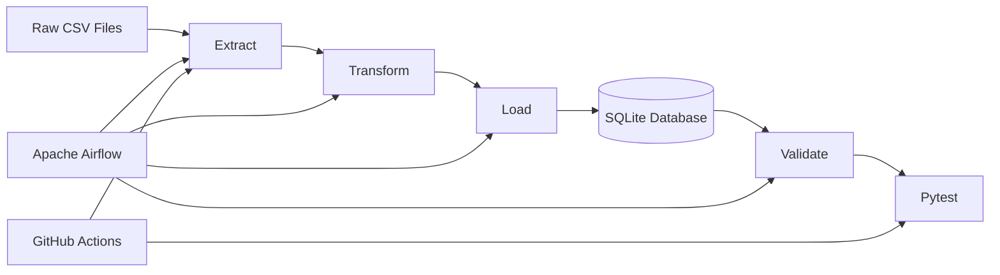

# 🛒 Ecommerce Data Platform


**End-to-end data engineering pipeline for a fictional e-commerce platform, focused on ETL, data quality, relational modeling, orchestration, automated testing and CI.**

Built with **Python, Pandas, SQLite, SQL, Apache Airflow, Docker, Pytest and GitHub Actions**.

---

## 📌 About the Project

This project simulates a real-world data engineering scenario where messy raw e-commerce data is processed through a complete and reproducible ETL pipeline.

The pipeline takes synthetic CSV datasets through:

**Extraction → Transformation → Loading → Validation → Automated Testing**

The project focuses not only on moving data, but also on:

* Data quality assessment
* Data cleaning and standardization
* Business-rule validation
* Referential integrity
* Database transactions
* Post-load validation
* Automated testing
* Pipeline orchestration
* Continuous Integration
* Documentation of data quality issues and engineering decisions

> **Note:** The datasets are synthetic and were created specifically for this portfolio project. They are intentionally designed to contain data quality problems that can be identified and handled by the pipeline.

---

## 🏗️ Architecture



### Pipeline Flow

```text
Raw CSV
   │
   ▼
Extract
   │
   ├── File validation
   ├── Schema checks
   ├── Null analysis
   └── Duplicate detection
   │
   ▼
Transform
   │
   ├── Cleaning
   ├── Standardization
   ├── Business rules
   └── Referential integrity
   │
   ▼
Load
   │
   ├── SQLite
   ├── Transactions
   └── Rollback on failure
   │
   ▼
Validate
   │
   ├── Record counts
   ├── Primary keys
   ├── Foreign keys
   └── Critical nulls
   │
   ▼
Automated Tests
   │
   ▼
CI — GitHub Actions
```

---

## 🛠️ Technologies

| Technology                  | Purpose                                |
| --------------------------- | -------------------------------------- |
| **Python**                  | ETL and data engineering               |
| **Pandas**                  | Data extraction and transformation     |
| **SQL**                     | Data modeling, validation and analysis |
| **SQLite**                  | Relational database                    |
| **Apache Airflow**          | Pipeline orchestration                 |
| **Docker / Docker Compose** | Local Airflow environment              |
| **Pytest**                  | Automated testing                      |
| **Git / GitHub**            | Version control                        |
| **GitHub Actions**          | Continuous Integration                 |

---

## 📂 Project Structure

```text
ecommerce-data-platform/
│
├── .github/
│   └── workflows/
│       └── ci.yml
│
├── data/
│   ├── raw/
│   │   ├── customers.csv
│   │   ├── products.csv
│   │   ├── orders.csv
│   │   ├── order_items.csv
│   │   ├── sellers.csv
│   │   └── payments.csv
│   │
│   ├── processed/
│   └── database/
│       └── ecommerce.db
│
├── src/
│   ├── extract.py
│   ├── transform.py
│   ├── load.py
│   ├── validate.py
│   ├── check_db.py
│   └── main.py
│
├── tests/
│   ├── test_extract.py
│   ├── test_load.py
│   ├── test_validate.py
│   ├── test_transform.py
│   └── test_database.py
│
├── dags/
│   └── ecommerce_pipeline.py
│
├── requirements.txt
├── schema.sql
├── docker-compose.yml
├── .gitignore
└── README.md
```

### Main Components

| File                         | Responsibility                          |
| ---------------------------- | --------------------------------------- |
| `src/extract.py`             | Reads and profiles raw datasets         |
| `src/transform.py`           | Cleans, standardizes and validates data |
| `src/load.py`                | Loads processed data into SQLite        |
| `src/validate.py`            | Performs post-load data quality checks  |
| `src/main.py`                | Orchestrates the complete pipeline      |
| `dags/ecommerce_pipeline.py` | Airflow orchestration                   |
| `schema.sql`                 | Database schema                         |
| `tests/`                     | Automated test suite                    |
| `.github/workflows/ci.yml`   | GitHub Actions CI                       |

---

## 🗄️ Data Model

The project contains six relational tables:


---

# 🚀 How to Run

## 1. Clone the repository

```bash
git clone https://github.com/mariellepmiziara/ecommerce-data-platform.git
cd ecommerce-data-platform
```

## 2. Create a virtual environment

### Windows PowerShell

```powershell
python -m venv .venv
.\.venv\Scripts\Activate.ps1
```

## 3. Install dependencies

```bash
pip install -r requirements.txt
```

## 4. Run the complete pipeline

From the repository root:

```bash
python -m src.main
```

The pipeline executes:

```text
Extract
   ↓
Transform
   ↓
Load
   ↓
Validate
```

A successful execution ends with:

```text
🎉 PIPELINE EXECUTADO COM SUCESSO
```

---

## 🧪 Run the Tests

Execute the complete test suite:

```bash
pytest tests/ -v --tb=short
```

The tests cover:

* Extraction
* Transformation
* Loading
* Validation
* Database integrity

---

# 🔄 Pipeline Stages

## 1. Extract

`extract.py` reads the raw CSV files and performs an initial quality assessment.

### Checks performed

* File existence
* CSV parsing
* Encoding
* Empty files
* Number of rows
* Number of columns
* Null values
* Duplicate records
* Data types

The extraction stage handles errors such as:

```text
FileNotFoundError
EmptyDataError
ParserError
```

---

## 2. Transform

`transform.py` applies the data cleaning and business rules.

### Cleaning

* Text normalization
* Whitespace removal
* Category standardization
* Date parsing
* Duplicate removal

### Validation rules

Examples:

```text
price > 0
quantity > 0
0 <= discount <= 1
```

Invalid records are removed before loading.

### Referential Integrity

Parent tables are cleaned before their dependent tables.

For example:

```text
orders
  ├── order_items
  └── payments

products
  └── order_items
```

If an order or product is removed during cleaning, dependent records referencing it are also removed.

This prevents orphan records from reaching the database.

---

## 3. Load

`load.py` loads the processed datasets into SQLite.

The current strategy is **full refresh**.

The database is recreated and the complete cleaned dataset is loaded on each execution.

The load process uses transactions:

```text
BEGIN
   ↓
Load tables
   ↓
Validation of load process
   ↓
COMMIT
```

If an error occurs:

```text
ROLLBACK
```

This prevents a partially loaded database.

---

## 4. Validate

`validate.py` performs post-load database validation.

Checks include:

* Table record counts
* Empty tables
* Primary-key duplicates
* Foreign-key integrity
* Critical null values
* Relationship consistency

If a validation rule fails, the pipeline raises:

```python
DataValidationError
```

This causes both the local pipeline and automated CI workflow to fail instead of silently continuing with invalid data.

---

# 🔍 Data Quality

Data quality is treated as a core part of the pipeline.

The project follows:

```text
Profile
   ↓
Clean
   ↓
Validate
   ↓
Load
   ↓
Validate Again
```

This approach prevents data quality problems from being silently propagated into the database.

---

# ⚠️ Data Quality Findings

During development, two relevant data quality issues were identified.

## 1. Referential Integrity Orphans — Fixed

Before the fix, `order_items` and `payments` contained records referencing orders/products that had been removed during the cleaning process.

A dedicated function was implemented:

```python
enforce_referential_integrity()
```

The result was:

```text
order_items: 24,997 → 24,734
payments:    10,000 → 9,997
```

All identified orphan records were removed before loading.

---

## 2. `orders.total_amount` vs. `order_items.net_amount`

A reconciliation analysis showed that:

```text
orders.total_amount
```

does not reconcile with:

```text
SUM(order_items.net_amount)
```

The discrepancy affects the entire dataset.

Aggregate comparison:

```text
orders.total_amount      ≈ $16.0M
order_items.net_amount   ≈ $78.9M
```

The investigation showed that the fields were independently generated in the synthetic dataset.

Because the discrepancy is systematic, rather than an isolated data-entry error, it was **documented instead of silently corrected**.

This demonstrates an important data engineering principle:

> **A pipeline should identify and document source-data problems instead of hiding them.**

---

# 📊 Exploratory Analysis

Exploratory analysis was performed using the trusted revenue sources.

Because the dataset is synthetic, the results are intentionally not interpreted as real-world business behavior.

### Revenue over time

Monthly revenue is relatively flat:

```text
≈ $1.3M – $1.6M
```

No meaningful seasonality was identified.

### Revenue by category

Approximate revenue:

```text
Books    → $16.2M
Beauty   → $15.7M
Sports   → $9.5M
```

The relatively narrow variation is atypical of a real e-commerce catalog.

### Payment methods

The four payment methods have similar order volumes and average order values.

No payment method presents a significant difference in behavior.

### Order status

```text
Completed → 73.3%
Cancelled →  9.62%
Pending   →  9.57%
Returned  →  7.5%
```

Average order value varies little by status.

### Sellers

The top seller generated approximately:

```text
$2.03M
```

across 236 orders.

The top sellers have relatively similar performance.

### Customer geography

Customers are relatively evenly distributed across Brazilian states, without strong geographic concentration.

---

# 💼 Documented Business Decisions

## `customers.email` can be NULL

A missing email does not invalidate a customer record.

Therefore:

```text
customers.email → nullable
```

This rule is explicitly supported by `validate.py`.

---

## `orders.total_amount` is not trusted

Due to the systematic reconciliation issue, financial analysis uses:

```text
order_items.net_amount
```

through the trusted analytical view:

```text
vw_orders_trusted
```

The original `orders.total_amount` is preserved as historical source information but is not used as the trusted revenue metric.

---

# 🔁 Load Strategy: Full Refresh vs. Incremental

The current implementation uses **full refresh**.

Every execution recreates the SQLite database and reloads the complete dataset.

### Why?

This is intentional because:

* The dataset is synthetic.
* The source is static.
* The dataset is relatively small.
* There is no continuous production feed.
* Full refresh is simple.
* The pipeline is naturally idempotent.

The dataset contains approximately:

```text
25K order_items
```

at most, making full refresh appropriate for this project.

### Production alternative

For a production pipeline processing millions or billions of records, incremental loading would be more appropriate.

A possible architecture would use:

1. A watermark such as `order_date` or `updated_at`.
2. A control table.
3. Incremental extraction.
4. Upsert logic.
5. Transactional watermark updates.

For example:

```sql
INSERT ... ON CONFLICT DO UPDATE
```

could be used to update existing records without duplicating them.

Incremental loading is intentionally not implemented because the current synthetic source does not require it.

---

# ☁️ Airflow Orchestration

The project includes an Apache Airflow DAG:

```text
dags/ecommerce_pipeline.py
```

The DAG orchestrates:

```text
Extract
   ↓
Transform
   ↓
Load
   ↓
Validate
```

The validation stage is designed to fail the DAG when data quality requirements are not met.

The local Airflow environment can be started with:

```bash
docker compose up
```

---

# 🔄 Continuous Integration

GitHub Actions automatically validates changes to the project.

The workflow:

```text
Checkout
   ↓
Python 3.12
   ↓
Install dependencies
   ↓
Run ETL pipeline
   ↓
Run pytest
```

The workflow is triggered on:

* Push to `main`
* Push to `master`
* Pull requests targeting `main`
* Pull requests targeting `master`

The current CI pipeline is **passing**.


If the pipeline fails, the workflow also attempts to upload the generated SQLite database as an artifact for troubleshooting.

---

# 📈 Current Pipeline Results

The current successful pipeline produces approximately:

| Dataset     | Records |
| ----------- | ------: |
| Customers   |   1,000 |
| Products    |     198 |
| Sellers     |      50 |
| Orders      |   9,997 |
| Order Items |  24,734 |
| Payments    |   9,996 |

These values represent the cleaned and validated output of the current synthetic dataset.

---

# 🎯 Engineering Practices Demonstrated

This project demonstrates practical application of:

* ETL pipeline architecture
* Python
* Pandas
* SQL
* Relational data modeling
* Data cleaning
* Data profiling
* Data quality validation
* Referential integrity
* Business-rule validation
* Error handling
* Transaction management
* Full-refresh loading
* Incremental-loading design
* Automated testing
* Pytest
* Apache Airflow
* Docker
* Git
* GitHub
* GitHub Actions
* Continuous Integration
* Reproducible pipelines
* Technical documentation
* Data-driven engineering decisions

---

# 🚧 Future Improvements

The core ETL pipeline, validation, automated tests, Airflow orchestration and CI are already implemented.

Possible future improvements:

* [ ] Move Docker/database credentials to `.env`
* [ ] Expand automated data quality tests
* [ ] Add Airflow failure notifications
* [ ] Implement an incremental-loading version
* [ ] Add more analytical SQL views
* [ ] Add a BI/dashboard consumption layer
* [ ] Explore a cloud-based architecture
* [ ] Add data lineage documentation
* [ ] Add containerized CI execution

---

# 👩‍💻 Author

**Marielle Miziara**

Data Engineering | Data Analytics | BI

Focused on building reliable data pipelines, transforming raw data into trustworthy information, and applying data engineering practices to real-world problems.

---

## ⭐ Project Purpose

This project was created as a portfolio demonstration of **data engineering fundamentals applied end-to-end**.

The main objective is not simply to make an ETL pipeline run successfully, but to demonstrate how a data engineer should approach:

```text
Raw Data
   ↓
Data Quality
   ↓
Transformation
   ↓
Data Integrity
   ↓
Reliable Storage
   ↓
Validation
   ↓
Automated Testing
   ↓
Orchestration
   ↓
Continuous Integration
```

**Reliable data starts with reliable engineering.**

